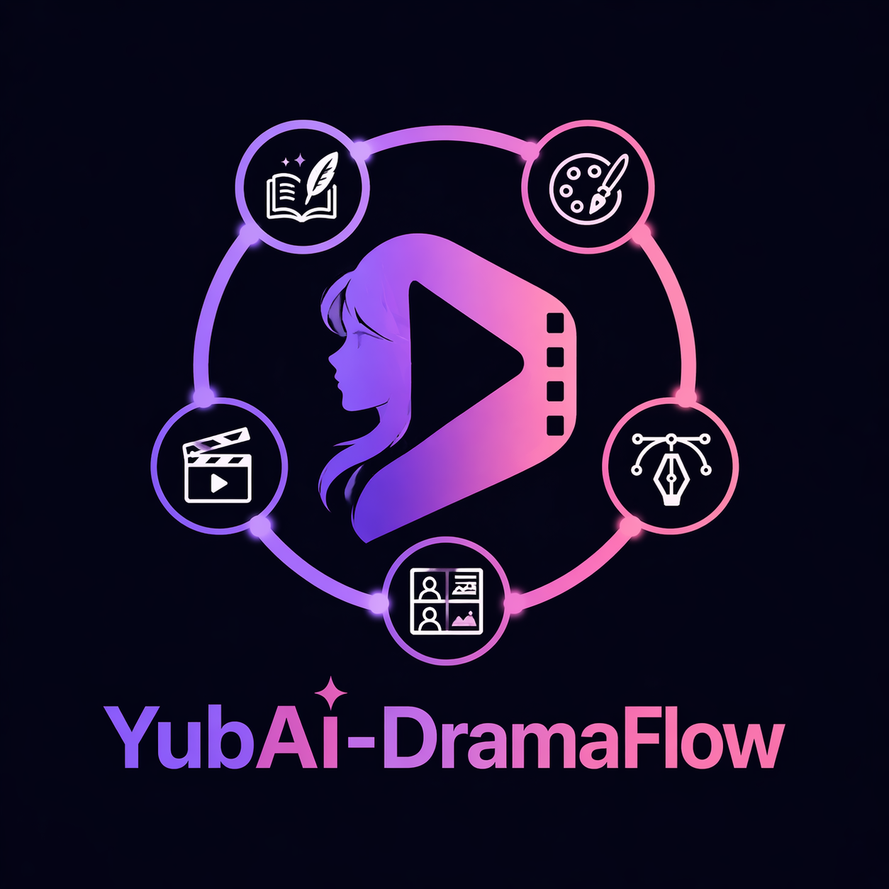
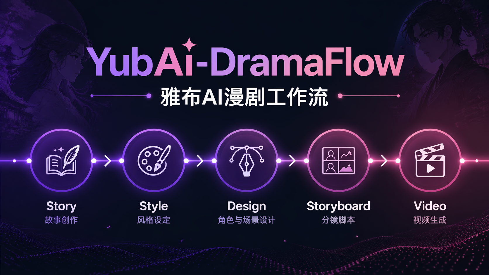

<p align="center">
  
</p>

<h1 align="center">🎬 YubAI-DramaFlow</h1>

<h3 align="center">雅布AI漫剧工作流 | AI Drama Production Workflow</h3>

<p align="center">
  
  
  
</p>

<p align="center">
  📖 从故事大纲到视频分镜的完整工作流 | 🎯 提升AI视频生成成功率
</p>

<p align="center">
  <b>中文版</b> | <a href="./README_EN.md">English</a>
</p>

<p align="center">
  
</p>

---

## ✨ 一句话介绍

**快速上手AI漫剧制作！** 一套经过实践验证的五阶段工作流，帮你从零开始系统化完成AI漫剧创作。

---

## 🎯 核心痛点与解决方案

**AI漫剧制作过程繁杂，不知道怎么开始？** 这个工作流帮你理清思路！

| 痛点 | 表现 | 解决方案 |
|:---:|------|---------|
| 😵 **不知道怎么开始** | 有想法但不知道第一步该做什么 | 五阶段流程图 + 入口指引 |
| 😫 **一致性差** | 同一人物在不同镜头里"变脸" | 风格锚定提示词 + 参考图 |
| 🎨 **风格混乱** | 不同镜头风格不统一，"拼凑感"强 | 风格定义模板 + 风格锚定 |
| 📝 **提示词质量不稳定** | 同样描述，生成结果差异大 | 标准化模板 + 专业术语库 |
| ❓ **不知道能做什么** | 设计了AI难以实现的镜头 | AI生成难度评估体系 |
| 🔍 **发现问题太晚** | 做到后期才发现前期有问题 | 五阶段自检制度 |

---

## 🚀 快速开始

### 1️⃣ 获取项目

**方式一：克隆项目（推荐）**

```bash
git clone https://github.com/your-username/YubAI-DramaFlow.git
cd YubAI-DramaFlow
```

**方式二：直接下载**

点击页面右上角 `Code` → `Download ZIP`，解压后即可使用。

**这是什么？**
- 这是一个**方法论工具包**，包含模板、指南、案例
- 无需安装任何依赖，下载即用
- 用你喜欢的AI工具（GPT、Claude、Gemini等）配合模板即可开始创作

### 2️⃣ 我该怎么开始？

```
┌─────────────────────────────────────────────────────────────────┐
│                      根据你的情况选择入口                          │
├─────────────────────────────────────────────────────────────────┤
│                                                                 │
│  📖 有故事/小说想改剧本？                                        │
│     → [网文改写指南](./references/网文改写指南.md)               │
│     → [网文改写模板](./templates/网文改写模板.md)                │
│                                                                 │
│  🎨 有剧本了，准备开始制作？                                     │
│     → [风格定义模板](./templates/风格定义模板.md) 👈 必须先做！    │
│     → [AI可行性评估](./templates/AI可行性评估模板.md)            │
│     → [人物设计模板](./templates/人物设计模板.md)                │
│     → [分镜表模板](./templates/分镜表模板.md)                    │
│                                                                 │
│  🎬 什么都还没有，想从头开始？                                    │
│     → [快速开始文档](./docs/快速开始.md)                         │
│     → [故事大纲模板](./templates/故事大纲模板.md)                │
│     → [风格定义模板](./templates/风格定义模板.md) 👈 别忘了！     │
│                                                                 │
│  ⚠️ 第一次用，怕踩坑？                                           │
│     → [新手避坑指南](./docs/新手避坑指南.md) 👈 必看！            │
│                                                                 │
└─────────────────────────────────────────────────────────────────┘
```

**💡 核心提示：风格定义是保证画面一致性的第一步！**
不要跳过「风格定义」环节，否则后期会出现严重的风格混乱问题。

### 3️⃣ 核心流程概览

```
┌─────────────────────────────────────────────────────────────┐
│                   AI漫剧制作五阶段流程                        │
├─────────────────────────────────────────────────────────────┤
│                                                             │
│  📚 【第一阶段：故事层】                                     │
│     故事大纲 → 小说文本 → 专业剧本 → AI可行性评估              │
│                                                             │
│  🎨 【第二阶段：风格层】
│     风格定义 → 风格锚定提示词 → 参考图收集                      │
│                                                             │
│  ✏️  【第三阶段：设计层】                                     │
│     人物设计 → 场景设计 → 资产库建立                          │
│                                                             │
│  🎬  【第四阶段：分镜层】                                     │
│     分镜脚本 → 分镜表 → 静帧图生成                            │
│                                                             │
│  🎥  【第五阶段：视频层】                                     │
│     视频提示词 → 视频分镜库 → 最终成片                        │
│                                                             │
└─────────────────────────────────────────────────────────────┘
```

**⚠️ 重要提示：风格定义是保证画面一致性的关键！**
每张生图都必须包含相同的「风格锚定提示词」，否则会出现风格混乱。

---

## 📁 项目结构

```
YubAI-DramaFlow/
├── 📄 README.md                    # 项目说明
├── 📜 LICENSE                      # MIT开源协议
├── 🤝 CONTRIBUTING.md              # 贡献指南
├── 📚 docs/                        # 文档目录
│   ├── 快速开始.md                  # 新手入门指南
│   ├── Quick_Start.md              # English Quick Start
│   ├── 工具选择指南.md              # 工具对比与选择建议
│   ├── 新手避坑指南.md              # 常见错误及解决方案
│   ├── 常见问题.md                  # FAQ
│   └── 更新日志.md                  # 版本更新记录
├── 📋 templates/                   # 模板目录
│   ├── 风格定义模板.md              👈 第一步必用！
│   ├── 故事大纲模板.md
│   ├── 剧本格式模板.md
│   ├── 网文改写模板.md
│   ├── 故事大纲扩写模板.md
│   ├── AI可行性评估模板.md
│   ├── 人物设计模板.md
│   ├── 场景设计模板.md
│   └── 分镜表模板.md
├── 📖 references/                  # 参考文档
│   ├── AI生成难度评估体系.md
│   ├── 一致性控制方案.md
│   ├── 剧本AI适配原则.md
│   ├── 五阶段自检制度.md
│   ├── 视频提示词指南.md
│   ├── 提示词编写规范.md
│   ├── 网文改写指南.md
│   ├── 分镜设计指南.md
│   ├── 常见问题解决方案.md
│   └── 质量评估标准.md
├── 💡 examples/                    # 案例参考
│   └── 获得异能的那一天，我和校花成为了同桌/
│       ├── 故事大纲.md
│       ├── 剧本.md
│       ├── 风格定义.md
│       ├── 人物设计.md
│       ├── 场景设计.md
│       └── 分镜表.md
└── 🎨 assets/                      # 资源文件
    ├── logo.png
    ├── preview.png
    └── qrcode.jpg
```

---

## 💡 使用示例

### 示例：人物设计

```markdown
## 【李凡】- 觉醒状态

### 中文提示词
李凡，17岁男生，黑色短发，普通长相。
觉醒状态：眼睛发出金色光芒，身边泛着金色光芒。
表情坚定，有少年感。
日漫风格，热血向。

### 英文提示词
Li Fan, 17-year-old Japanese anime boy,
black short messy hair, average appearance,
glowing golden eyes, golden aura surrounding him,
determined expression, awakened power,
anime style, manga style,
dramatic golden lighting, dynamic pose,
masterpiece, best quality, highly detailed.

### 负面提示词
blurry, low quality, deformed, bad anatomy, extra limbs,
missing limbs, watermark, text, bad face, ugly face
```

---

## 🛠️ 核心工具选择

> 详细对比请查看 [工具选择指南](./docs/工具选择指南.md)

### AI写剧本（御三家）

| 模型 | 特点 | 适用场景 |
|------|------|----------|
| **Claude Opus 4.7** | 指令遵循精准、逻辑严谨 | 剧本创作、对白设计 |
| **GPT-6** | 200万Token上下文 | 长篇故事、快速迭代 |
| **Gemini 3.1 Pro** | 推理能力强、多模态 | 复杂故事、网文改写 |

### 文生图工具

| 优先级 | 工具 | 特点 |
|--------|------|------|
| 首选 | **GPT-Image-2** | 提示词理解最强、风格稳定 |
| 次选 | **NanoBanana系列** | 照片级真实感、文字渲染好 |
| 备选 | **Midjourney** | 艺术感强、风格多样 |
| 开源 | **Flux** | 手部渲染好、可定制 |

### 图生视频工具

| 优先级 | 工具 | 特点 |
|--------|------|------|
| 期待 | **HappyHorse** | 业内期待的新一代模型 |
| 首选 | **Seedance 2.0** | 效果稳定、功能全面 |
| 次选 | **可灵 O3** | 7合1功能、4K输出、原生音频 |
| 快速 | **Vidu 2.0** | 极速生成、动漫风格强 |
| 动作 | **Hailuo** | 复杂动作场景表现好 |

### 推荐工具组合

| 场景 | AI剧本 | 文生图 | 图生视频 | 剪辑 | 预估成本 |
|------|--------|--------|----------|------|----------|
| 新手入门 | Claude免费额度 | Midjourney基础 | Vidu免费额度 | 剪映 | ≈¥70/月 |
| 标准配置 | GPT-6 | GPT-Image-2 | Seedance 2.0 | 剪映 | ≈¥500/月 |
| 专业配置 | 多模型组合 | 多工具组合 | 多模型组合 | DaVinci | ≈¥1000/月 |

---

## 📚 学习路径

```
新手入门
  ├── 1. 阅读 [快速开始.md](./docs/快速开始.md)
  ├── 2. 查看 [人物设计模板](./templates/人物设计模板.md)
  ├── 3. 尝试制作第一个AI漫剧场景
  │
  进阶提升
  ├── 1. 学习 [AI生成难度评估体系](./references/AI生成难度评估体系.md)
  ├── 2. 掌握 [一致性控制方案](./references/一致性控制方案.md)
  ├── 3. 应用 [五阶段自检制度](./references/五阶段自检制度.md)
  │
  熟练掌握
  ├── 1. 优化 [视频提示词](./references/视频提示词指南.md)
  ├── 2. 建立自己的 [资产库](./templates/)
  └── 3. 贡献你的案例到 examples/
```

---

## 🤝 贡献指南

欢迎贡献！请阅读 [贡献指南](./CONTRIBUTING.md)。

**贡献方式：**
- 🐛 提交 Issue 报告问题
- 💡 提出新功能建议
- 📝 完善文档或添加案例
- 🔧 提交 Pull Request 修复问题

---

## 📄 License

本项目采用 [MIT License](./LICENSE) 开源 - 可以免费商用，无需授权，只需保留署名。

---

## 🙏 致谢

感谢所有为 AI 视频创作领域做出贡献的创作者们！

---

## 👋 关注作者

> 这个项目由 **鱼摆摆** 倾心打造，分享更多 AI 视频创作干货！

### 📺 B站主页

[**@鱼摆摆喂**](https://space.bilibili.com/299467431) - AI领域UP主，分享AI工具、视频创作、效率提升等内容

### 📱 微信公众号

**「鱼摆摆喂」** - 分享AI视频创作技巧、工具测评、实战案例

<p align="left">
  
</p>

> 扫码关注，获取更多AI创作干货！

---

<p align="center">
  <sub>Made with ❤️ for AI Video Creators</sub>
</p>
